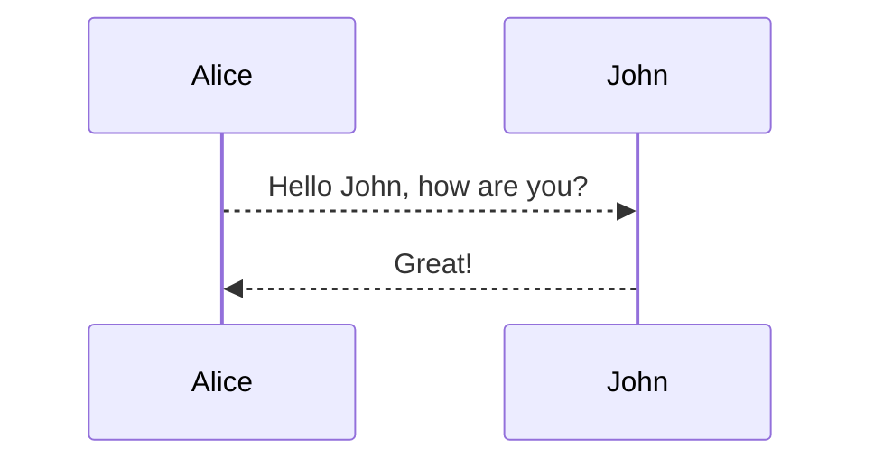

markdown语言的语法参考，此篇笔记的所有语法在此博客中均已支持

## 常用markdown语法

|   功能   | 语法            | 备注                                                                  |
| :------: | --------------- | --------------------------------------------------------------------- |
|   标题   | # 标题名称      | 行首位置使用“井号+空格+标题文本”；井号数量表示标题层级，依次为H1~H6 |
|  块引用  | >文字块         | 行首位置使用右箭号，中间可有可无空格                                  |
|   斜体   | \*文字块*       | 前后使用1个星号，为一组                                               |
|   粗体   | \*\*文字块**    | 前后使用2个星号，为一组                                               |
|  删除线  | \~\~文字块~~    | 前后使用2个波浪线，为一组                                             |
|  下划线  | --–            | 使用3个减号后，按回车键                                               |
| 无序列表 | - 条目          | 行首位置使用“减号+空格+条目”后，按回车键                            |
| 有序列表 | 数字. 条目      | 行首位置使用“数字序号+句点+空格+条目”后，按回车键                   |
| 任务列表 | - [x]           | [ ]内加x表示完成，不加表示方框                                        |
|  超链接  | \[alt](url)     | alt（可选）为url的替换文本，url（必选）为超链接地址                   |
|   图像   | \!\[alt](url)   | 类似超链接，只是多了一个感叹号                                        |
|   代码   | \`源代码`       | 前后使用1个反引号；底色长度等于源代码长度                             |
|  代码块  | \~\~\~java 源代码~~~ | 前后使用3个波浪线，波浪线后跟回车键；后面接着选择语言                |
|  代码块  | \`\`\`java 源代码`~~~` | 前后使用3个`，波浪线后跟回车键；后面接着选择语言                   |
---

**目录**

* TOC
  {:toc}
---

## 补充

### 换行

在行后面按两下空格表示换行。（此方法在实操的过程种无法查看到空格，有缺陷）
还有一种方法，在行尾添加“结尾空格”或 HTML 的 `<br>` 标签来实现换行，这种方法只需要正常换行即可

### 转义字符语法

要显示原本用于格式化 Markdown 文档的字符，请在字符前面添加反斜杠字符 \ 。

### 注释

注释利用的是HTML语法，参考用法如下：
\<\!-- 这里被注释了 -->

<!--这里被注释了-->

### 表格对齐

1. :----- 表示左对齐
2. :----: 表示中对齐
3. -----: 表示右对齐

### 锚点

```
* [补充](#补充)
```

* [补充](#补充)

### Emoji 表情

🐫
😊
😄

### Footnotes 角标

This is a text with footnote[^1].

### mermaid 甘特图




### sequence 时序图

```sequence
Andrew->China: Says Hello
Note right of China: China thinks\nabout it
China-->Andrew: How are you?
Andrew->>China: I am good thanks!
```

### flowchart 流程图

```flow
st=>start: Start
e=>end
op1=>operation: My Operation
sub1=>subroutine: My Subroutine
cond=>condition: Yes
or No?
io=>inputoutput: catch something...

st->op1->cond
cond(yes)->io->e
cond(no)->sub1(right)->op1
```

### mathjax 数学公式

When

$$
(a \ne 0)
$$

, there are two solutions to

$$
(ax^2 + bx + c = 0)
$$

 and they are

$$
x = {-b \pm \sqrt{b^2-4ac} \over 2a}.
$$

### mindmap 思维导图

```mindmap
# topic
## topic2
### topic2.1
### topic2.2
## topic3
<!--Note-->
这是一个备注
<!--/Note-->
### topic3.1
### topic3.2
#### topic3.2.1
#### topic3.2.2
#### topic3.2.3
#### topic3.2.4
#### topic3.2.5
### topic3.4
### topic3.5
### topic3.6
```

[^1]: Here is the footnote 1 definition.
    
## 参考链接

[markdown教程](https://markdown.hk/)
[markdown基础语法](https://markdown.com.cn/basic-syntax/)
[风月博客](https://kuang.netlify.app/markdown/markdown%E8%AF%AD%E6%B3%95.html)
[码志](https://mazhuang.org)
